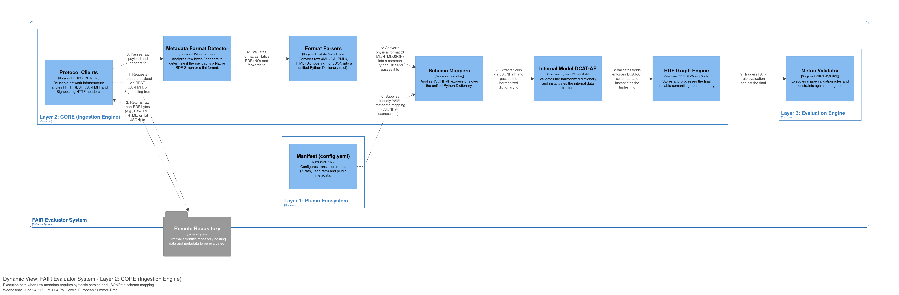

# Contribuciones
- El propio **evaluador sea FAIR**:
    1. Mediante tipado y estructura semántica &rarr; `DCAT Pydantic datamodel`
    2. Informe final
       - Formato JSON-LD
       - [Grafo de provenance + empaquetado (ro-crate)](#extensión-grafo-de-provenance)
- Configuración del plugin
    - Formato YAML &rarr; `config.yaml`/`manifest.yaml`
    - Simplificar o eliminar la lógica en `plugin.py` &rarr; idealmente el investigador sólo nos da el `config.yaml`
- Otros:
    - Corrección de la lógica de mapeo: Término Interno Estándar &rarr; Ruta de extracción.
    - Actual `config.ini`: Limitación de profundidad `depth=2` en parseo de payload &rarr; Solución: [JSONPath](https://github.com/json-path/JsonPath)

# Roadmap

## 1. Mapeo interno a DCAT
- Workflow:
    1. Se obtiene el payload del repo de datos (externo) &rarr; componente `Protocol Clients`
        - OAI-PMH (XML) &rarr; `xmltodict`
        - Signposting (HTML) &rarr; `BeautifulSoup` `json-ld`
    2. Componente `Metadata Format Detector` &rarr; sigue el workflow de "NoRDF"
        - Cuando exista el camino "RDF" DEBE identificar el tipo de contenido (MIME type)
    3. Componente `Format Parser` &rarr; recibe el payload y normaliza la sintaxis antes de evaluar la semántica &rarr; Python `dict`
    4. Componente `Schema Mapper` &rarr; aplica las expresiones JSONPath definidas en `metadata_mappings` (`config.yaml`) &rarr; Python `dict` con claves internas
        1. Lee el `config.yaml` (plugin)
        2. Ejecuta JSONPath's `jsonpath_ng` sobre Python `dict` que devuelve `Format Parser`
  5. Componente `Internal Model DCAT`&rarr; aplica el DCAT data model interno al Python `dict` obtenido de `Schema Mapper` &rarr; `DCAT Pydantic datamodel` &rarr; **JSON-LD**
- El DCAT resultante (grafo RDF) podría ser la entrada a `ConfigTerms` (quizás interesante sólo como primera iteración) o sustituirlo por completo.

### *Ejemplo*: Transformación `Format Parser` &rarr; `Schema Mapper`

**Salida Format Parser (Python `dict`)**
```json
raw_parsed_dict = {
    "record": {
        "header": {
            "identifier": "oai:zenodo.org:1234567",
            "datestamp": "2026-03-24T10:00:00Z"
        },
        "metadata": {
            "oai_dc:dc": {
                "dc:title": "Dataset de prueba para la evaluación FAIR",
                "dc:description": "Este es un resumen del contenido del dataset.",
                "dc:rights": "https://creativecommons.org",
                "dc:subject": [
                    "Ciencia Abierta",
                    "Metadatos",
                    "FAIR"
                ]
            }
        }
    }
}
```

**Reglas de mapeo de metadatos en Plugin config** &rarr; JSONPath
```yaml
# config.yaml, manifest.yaml
metadata_mapping:
  id: "$.record.header.identifier"
  title: "$.record.metadata['oai_dc:dc']['dc:title']"
  description: "$.record.metadata['oai_dc:dc']['dc:description']"
  license: "$.record.metadata['oai_dc:dc']['dc:rights']"
  keywords: "$.record.metadata['oai_dc:dc']['dc:subject'][*]"
```

**Salida de `Schema Mapper`**
```json
# harmonized_dict
{
    "description": "Este es un resumen del contenido del dataset.",
    "id": "oai:zenodo.org:1234567",
    "keywords": ["Ciencia Abierta", "Metadatos", "FAIR"],
    "license": "https://creativecommons.org",
    "title": "Dataset de prueba para la evaluación FAIR"
}
```
La llamada al DCAT DataModel interno &rarr; `DCATDatasetModel(**harmonized_dict)`


### *Extensión*: Grafo de provenance
- Son aquellos metadatos sobre la transacción que se obtienen del repo &rarr; Mejora principios críticos de auditoría y provenance (R de Reusable)
    - Ejemplos: *timestamp* del request, *versión de la API* del repo/registro
- Se inyectan de forma automática, sin que el plugin tenga que mapearlos.
    - En DCAT-AP, esto se mapea usando la clase `dcat:CatalogRecord`
- Tendríamos **2 (sub)grafos que añaden al FAIR report final**
    1. Metadata Dataset &rarr; Subgrafo para evaluar indicadores RDA
    2. Transaction Metadata &rarr; Subgrafo con metadatos de procedencia
- Utilizar **RO-Crate como formato de empaquetado para el FAIR report**:
    - Combinando ontologías:  PROV-O (para la procedencia de la ejecución), Schema.org (base nativa de RO-Crate) y vocabularios FAIR (como el FAIR Implementation Profile o métricas del RDA)
    - Provenance automático con `ro-crate-py`

### *Extensión*: FAIR assessment (RDA indicators) con SHACL (validador nativo RDF)
1. Contribución a la **estandarización de los FAIR assessments** mediante SHACL constraints
    - Para Data:
        - **FAIR-Square (FAIR^2) Specification** ([repo](https://github.com/fair-squared/fair2-spec))
            - **Sus SHACL no evalúan directamente los indicadores RDA, pero sí la extienden**, de manera que FAIR-Square puede ejecutarse como perfil especializado/avanzado sobre el RDA, proporcionando constraints avanzados como el uso de vocabularios FAIR estandarizados (QUDT, CRediT) o vocabularios ML como "ML Croissant"
            - Asume que los inputs son grafos RDF (TTL, JSON-LD). Aquí **FAIR-EVA permitiría la integración directa con los repositorios que devuelven metadatos NoRDF**
    - Para Software FAIRness:
        - QUARE: [repo](https://github.com/uniba-mi/quare), [paper](https://easychair.org/publications/preprint/3pLtp/open)
    - Data Quality: [SHACL para 69 métricas de calidad distintas](https://arxiv.org/html/2507.22305v1)
    - [DataSpaces](https://github.com/moosmannp/Enhancing-SHACL-Validation-Through-Constraint-Templates-and-Inference) ([paper](https://ceur-ws.org/Vol-3759/workshop3.pdf)) and repos
    - Ontologías: https://www.inderscienceonline.com/doi/pdf/10.1504/IJMSO.2022.131133
2. Usar extensiones como S**HACL-DS o aislar los contextos mediante *Named Graphs* independientes para analizar los dos subgrafos (dataset, provenance)** de forma individual.
3. Usar SHACL-SPARQL para reglas de validación complejas (ej RDA_FI_01M en Turtle) &larr; **Mejror usar JSON-LD para SHACL(-SPARQL)**
    ```turtle
    @prefix sh: <http://w3.org> .
    @prefix dcat: <http://w3.org> .
    @prefix dcterms: <http://purl.org> .
    @prefix xsd: <http://w3.org> .
    @prefix ex: <http://example.org> .

    ex:RDA_F1_01M_Shape
        a sh:NodeShape ;
        # Se aplica automáticamente a todas las instancias de dcat:Dataset en el grafo
        sh:targetClass dcat:Dataset ;
        
        sh:sparql [
            a sh:SPARQLConstraint ;
            sh:message "Error RDA-F1-01M: El identificador del dataset no es un PID válido (DOI, Handle o ARK)." ;
            sh:severity sh:Violation ;
            # El parámetro $this se vincula automáticamente al nodo del dataset que se evalúa
            sh:select """
                PREFIX dcat: <http://w3.org>
                PREFIX dcterms: <http://purl.org>
                
                SELECT $this ?id_value
                WHERE {
                    # 1. Extraemos el identificador mapeado en DCAT-AP
                    $this dcterms:identifier ?id_value .
                    
                    # 2. Forzamos que se convierta a String para aplicar la Regex
                    BIND(STR(?id_value) AS ?id_str) .
                    
                    # 3. FILTRO: El validador fallará si el identificador NO cumple los patrones PID
                    FILTER (
                        !REGEX(?id_str, "^(https?://(dx\\.)?doi\\.org/10\\.\\d{4,9}/[-._;()/:A-Z0-9]+)$", "i") && # DOI URL
                        !REGEX(?id_str, "^(10\\.\\d{4,9}/[-._;()/:A-Z0-9]+)$", "i") &&                             # DOI plano
                        !REGEX(?id_str, "^(https?://hdl\\.handle\\.net/\\d{5,}/.+)$", "i") &&                       # Handle URL
                        !REGEX(?id_str, "^(ark:/\\d{5}/.+)$", "i")                                                  # ARK
                    )
                }
            """ ;
        ] .
    ```
4. Automatización con `pySHACL`
5. **SHACL está atado a versiones de DCAT**, por lo tanto es necesario generar documentos SHACL (Turtle) para cada versión de DCAT soportada
    - Esto se registraría también en el RO-Crate